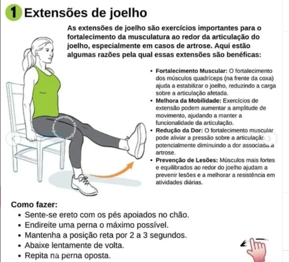
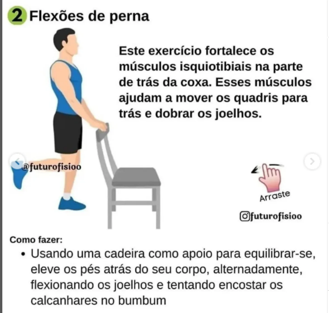
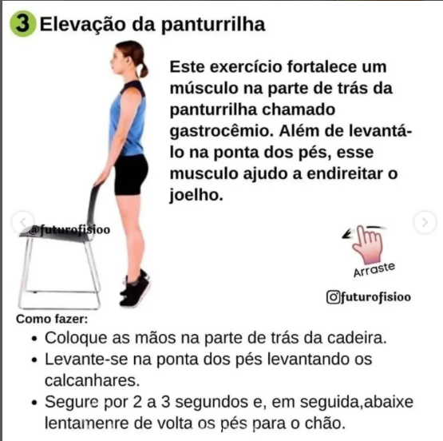
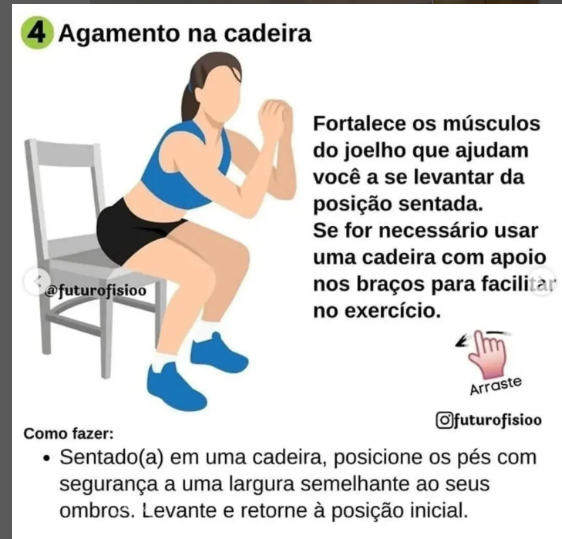
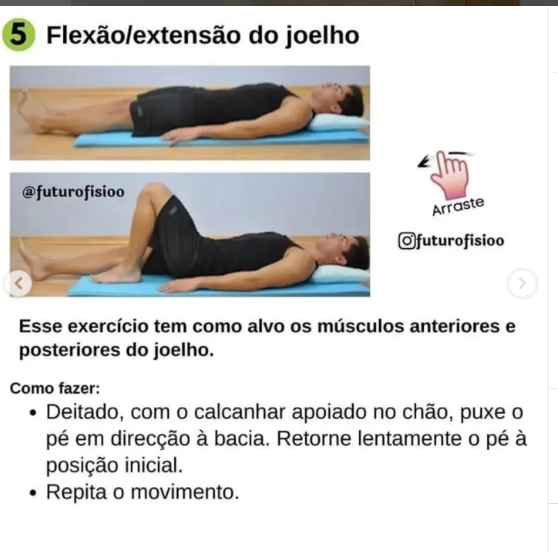
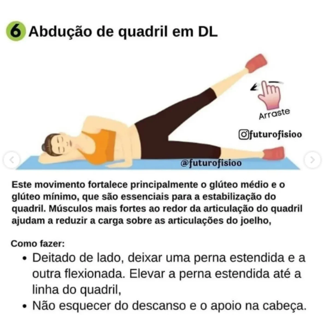
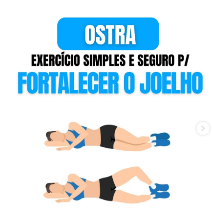
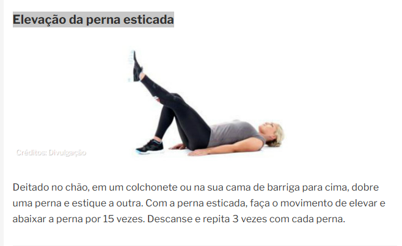
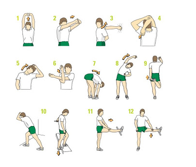

## 🏊‍♀️ Alongamento Pré-Natação (5 minutos)

### 1. Rotação de Ombros (30 segundos)
* Gire os ombros para trás em movimentos amplos e lentos.
* Depois, gire para frente.
* Ajuda a ativar a musculatura do manguito rotador.

## 2. Alongamento de Pescoço (1 minuto)
* Incline a cabeça para o lado, aproximando a orelha do ombro.
* Mantenha por 15 segundos de cada lado.
* Depois, olhe para baixo (queixo no peito) e segure por 15 segundos.
* Finalize olhando para cima (pescoço estendido) por mais 15 segundos.

## 3. Braço Cruzado na Frente do Peito (30 segundos cada lado)
* Puxe o braço estendido com a outra mão, mantendo-o na altura do peito.
* Alongamento ótimo para o deltoide e trapézio.

## 4. Torção de Tronco (1 minuto)
* Em pé, com os pés afastados na largura dos ombros, gire o tronco para um lado, mantendo os quadris fixos.
* Segure por 15 segundos e troque de lado.
* Repita duas vezes.

## 5. Alongamento de Quadril e Posterior da Coxa (1 minuto)
* Em pé, cruze uma perna sobre a outra e incline o tronco para frente.
* Mantenha por 30 segundos e troque as pernas.
* Ajuda a liberar tensão na lombar e preparar os membros inferiores.

----

--- 

## exercícios para fortalecer a coluna lombar e cervical

Investir no cuidado da região lombar e cervical traz benefícios a longo prazo. A prática regular de movimentos específicos pode aumentar a flexibilidade e a força muscular, reduzindo o risco de lesões. Abaixo, confira uma lista de atividades que ajudam a promover a saúde dessa área.

### 1. Alongamento de Gato e Vaca

Comece em quatro apoios, com as mãos alinhadas aos ombros e os joelhos no chão. Inspire, arqueando as costas para baixo e levantando a cabeça. Expire, curvando as costas para cima e levando o queixo ao peito. 
Repita o movimento por 10 a 15 vezes.

---
### 2. Dead Bug

Deite-se de costas com os braços estendidos para cima e as pernas elevadas, formando um ângulo de 90 graus. Estenda uma perna e o braço oposto, alternando os lados. Faça 10 repetições por série.

---

### 3. Elevação Pélvica

Deite-se de costas com os joelhos flexionados. Eleve o quadril, mantendo os pés no chão. Desça lentamente e repita o movimento por 15 vezes. Essa atividade ajuda a fortalecer a região lombar.

---

### 5. Equilíbrio em Quatro Apoios

Em quatro apoios, estenda um braço e a perna oposta, mantendo o equilíbrio. Segure por 10 segundos e alterne os lados. Essa atividade promove o fortalecimento do core e da região lombar.

---

### 6. Alongamento dos Isquiotibiais

Sente-se no chão com as pernas estendidas. Incline o tronco para frente, tentando alcançar os pés. Mantenha a posição por 20 segundos e repita 3 vezes.

--- 

# 9. Rotação do Pescoço

Sente-se com a coluna ereta. Gire a cabeça lentamente para um lado, mantendo a posição por 5 segundos. Repita 5 vezes de cada lado, duas vezes ao dia.

--- 

--- 
--- 
## Joelhos
---
* 
* 
* 
* 
* 
* 
* 
* 
* 

---

### Cervical -  alongamentos rápidos 

--- 

## 🧘‍♀️ Alongamentos Pós-Natação (10 a 15 minutos)

Aqui está uma sugestão de rotina de alongamentos pós-natação, focada em aliviar tensões na cervical, 
ombros e costas, promovendo recuperação muscular e mobilidade:

---

🔹 1. Alongamento cervical

* Inclinação lateral do pescoço
Em pé ou sentada, incline a cabeça para o lado, como se fosse encostar a orelha no ombro.
Mantenha por 20 segundos.
Repita 2 vezes de cada lado.

* Rotação suave da cabeça
Gire a cabeça lentamente para olhar por cima do ombro.
Mantenha por 10 segundos.
Repita 2 vezes de cada lado.

---

🔹 2. Alongamento de ombros e trapézio

* Alongamento cruzado de ombro

Cruze um braço sobre o peito e segure com o outro.
Mantenha por 30 segundos.
Repita com o outro braço.

* Alongamento do trapézio superior

Com uma mão, segure a lateral da cabeça e puxe suavemente para o lado.
Mantenha por 20 segundos.
Repita 2 vezes de cada lado.

---

🔹 3. Alongamento de costas e coluna

* Alongamento do latíssimo do dorso (costas)
Em pé, segure o pulso de um braço acima da cabeça e incline o tronco para o lado oposto.
Mantenha por 30 segundos.
Repita com o outro lado.

--- 

🔹 4. Alongamento de peitoral

* Abertura de peito na parede : Apoie a mão na parede com o braço estendido para trás.
Gire o corpo levemente para o lado oposto. Mantenha por 30 segundos. 
Repita com o outro braço.

---

> 
> ✅ Dicas:
> 
> Faça os alongamentos logo após sair da piscina, ou após o banho.
> 
> Respire profundamente durante cada posição.
> 
> Evite movimentos bruscos; mantenha cada posição de forma relaxada.
> 
> Se sentir dor, reduza a intensidade ou consulte um fisioterapeuta.
> 
> 
--- 

--- 
